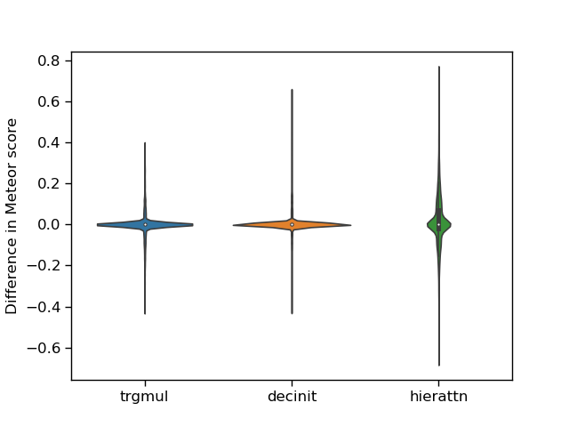

# Awareness Evaluation

This repository implements the Adversarial Awareness Evaluation defined in Elliott (2018). 

## Dependencies:

* Python 3.5+
* scipy
* numpy
* seaborn
* matplotlib

## Reproducing Table 1 and Figure 2

1. Unzip the system output data: 

```
for x in `ls data/`; do cd data/$x/; unzip $x.zip; cd -; done
```

This produces three new directories inside `data`: `decinit`, `hierattn`, and `trgmul`. Each directory contains the decoded sentences, the segment-level Meteor scores (`.scores`), and the segment-level language modelling scores (`logps-`).

2. Run the `awareness.py` script on the output `.scores` files. The output shows you the average Meteor score of the model evaluated with the congruent image data, followed by the average Meteor score of the model evaluated with the incongruent image data, the average Awareness of the model (Eq. 1), and whether we can reject the null hypothesis given the results.

```
python awareness.py --congruent data/decinit/decinit.val.tok.de.congruent.scores \
                    --incongruent data/decinit/decinit.*.random*.scores \
                    --meteor

Mean congruent score: 0.5852
Mean incongruent score: 0.5824 +- 0.00043

Average awareness: 0.0028 +- 0.00043
Fisher's method Chi-Squared = 32.79, p=0.0003
```

3. Run the `violin_plots.py` script to generate Figure 2.

```
python violin_plots.py --model1 data/trgmul/trgmul.val*.scores 
                       --model2 data/decinit/decinit.val*.scores 
                       --model3 data/hierattn/hierattn.val*.scores 
                       --meteor
```


